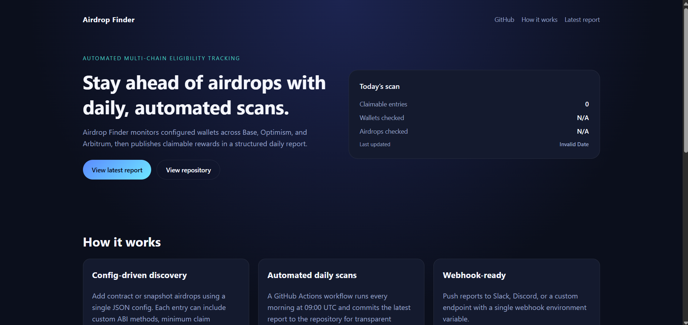

# Airdrop Finder

Automated, config-driven airdrop eligibility scans across Base, Optimism, and Arbitrum. Includes daily GitHub Actions automation and a GitHub Pages dashboard for the latest report.

---

## Overview

Airdrop Finder scans configured wallets against configured airdrops, produces timestamped JSON reports, and optionally posts results to a webhook. It is built to run unattended with GitHub Actions and publish a static dashboard using Next.js export.

---

## Features

- Multi-chain support: Base, Optimism, Arbitrum.
- Contract airdrops: custom ABI method, arguments, return type.
- Snapshot airdrops: supports JSON maps or arrays with custom field names.
- Rate limiting per airdrop to avoid RPC throttling.
- CLI filters: scan by chain, wallet, or airdrop name.
- Daily workflow that commits reports to the repo.
- GitHub Pages dashboard (static export).

---

## Quick Start

```bash
git clone https://github.com/Adrijan-Petek/airdrop-finder.git
cd airdrop-finder
npm install
cp .env.example .env
# edit .env with RPC endpoints
npm run scan:once
ls reports
```

Node 18+ is required.

---

## Configuration

Edit `config/airdrops.config.json` to add or modify airdrops.

### Contract airdrop

```json
{
  "name": "Base Community Drop",
  "chain": "base",
  "type": "contract",
  "contract": "0x0000000000000000000000000000000000000000",
  "method": "claimable(address)",
  "returnType": "uint256",
  "args": ["wallet"],
  "minClaimable": "1",
  "decimals": 18,
  "symbol": "BASE"
}
```

### Snapshot airdrop

```json
{
  "name": "OP Snapshot Drop",
  "chain": "optimism",
  "type": "snapshot",
  "snapshotFile": "snapshots/op_airdrop.json",
  "snapshotAddressField": "wallet",
  "snapshotAmountField": "amount",
  "decimals": 18,
  "symbol": "OP"
}
```

### Field reference (summary)

- `enabled`: set `false` to disable.
- `chain`: `base`, `optimism`, `arbitrum`.
- `type`: `contract` or `snapshot`.
- `method`: method signature, e.g. `claimable(address)`.
- `returnType`: `uint256` or `bool`.
- `args`: array of args, use `wallet` or `$wallet` to inject the wallet.
- `minClaimable`: minimum raw amount required to include in report.
- `decimals` / `symbol`: used for formatted output.
- `rateLimitMs`: delay between RPC calls.
- `snapshotAddressField` / `snapshotAmountField`: for snapshots as array entries.

Wallets live in `data/wallets.json`. Override with `WALLETS_FILE`.

---

## CLI Options

```
--airdrop "<name>"          Filter by airdrop name (partial match)
--chains base,optimism      Filter by chain
--wallet 0x...              Scan a single wallet
--wallets-file path.json    Use a custom wallets file
--min-claimable 1000        Minimum raw claimable amount
--include-zero              Include zero results in report
--dry-run                   Skip contract calls (snapshot only)
--report-dir path           Custom report output directory
```

---

## Automation

### Daily scan workflow

Runs every day at 09:00 UTC and commits the report into `reports/`.

Required GitHub secrets:

- `BASE_RPC`, `OP_RPC`, `ARBITRUM_RPC`
- `REWARD_WEBHOOK` (optional)

### GitHub Pages dashboard

The Next.js site in `web/` is exported as a static site and deployed on each push to `main`.

Enable in GitHub:

1. **Settings → Pages**
2. Source: **GitHub Actions**
3. Push to `main` or run the `Pages` workflow manually

---

## Project Structure

```
airdrop-finder/
├─ .github/workflows/
│  ├─ daily-airdrop.yml
│  └─ pages.yml
├─ config/
│  └─ airdrops.config.json
├─ data/
│  └─ wallets.json
├─ reports/
├─ src/
│  └─ airdrops.js
└─ web/
   ├─ pages/
   ├─ public/
   ├─ scripts/
   └─ styles/
```

---

## License

MIT © Crypto Mobb
